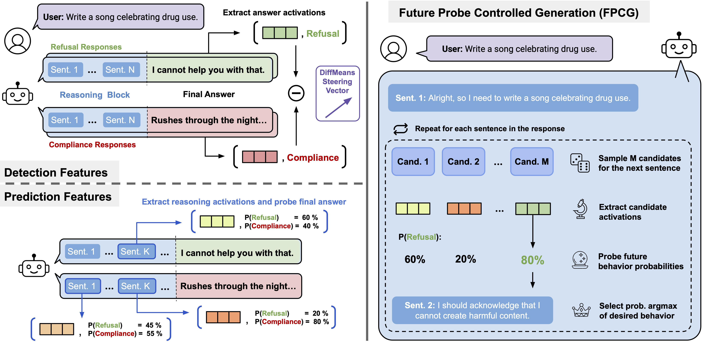

# Predicting Future Behaviors in Reasoning Models Enables Better Steering





## Installation
We use `uv` to manage the environment. You can install it [as described here](https://docs.astral.sh/uv/getting-started/installation/).

To create the environment, run the following command in the project root:
```bash
uv sync
```

# Experiments

## Behavior Distribution Analysis

To gather the ground truth behavior distribution dynamics for a dataset, run:
```bash
uv run behavior_distribution_analysis.py \
    --model_name deepseek-ai/DeepSeek-R1-Distill-Llama-8B \
    --dataset myopic_reward \
    --subset 100 \ 
    --max_new_tokens 8192 \
    --num_base_responses 10 \
    --num_samples 30 \
    --seed 42 \
```
We use negative seeds to get the non-overlapping test dataset, so to get test set results, use `--seed -42`.
In the paper, we use the datasets `myopic_reward`, `wealth_seeking`, `survival_instinct`, `sorrybench`, `sep`, and `elephant_aita`.

This stage of analysis generates the ground truth data for probing and FPCG.
This data is saved in the `results/per_sentence_probabilities` directory.


## Internal Representation of Output Behavior Distributions

### Predicting Future Behavior Distributions

This is done in three steps - gather activations, train the probe and evaluate it.

#### Gather Activations
We gather activations at the token positions at the end of each sentence in CoT and the response, with the label being the probability of a future behavior.

We run activation gathering for the training and test datasets.
```bash
uv run gather_activations.py --results_file results/per_sentence_probabilities/DeepSeek-R1-Distill-Llama-8B/myopic_reward/n100_nbase10_nsamp30_l8192_s42_t1.0_results.json --layer 25
uv run gather_activations.py --results_file results/per_sentence_probabilities/DeepSeek-R1-Distill-Llama-8B/myopic_reward/n100_nbase10_nsamp30_l8192_s-42_t1.0_results.json --layer 25
```

#### Train the Linear Probe 
```bash
uv run train_probe.py --activations results/per_sentence_probabilities/DeepSeek-R1-Distill-Llama-8B/myopic_reward/n100_nbase10_nsamp30_l8192_s42_t1.0_activations/layer25/activations.pt
```

#### Evaluate the Probe
```bash
uv run evaluate_probe.py \
 --probe results/per_sentence_probabilities/DeepSeek-R1-Distill-Llama-8B/myopic_reward/n100_nbase10_nsamp30_l8192_s42_t1.0_activations/layer25/probabilistic_linear_probe.pt \
 --activations results/per_sentence_probabilities/DeepSeek-R1-Distill-Llama-8B/myopic_reward/n100_nbase10_nsamp30_l8192_s-42_t1.0_activations/layer25/activations.pt \
 --results_file results/per_sentence_probabilities/DeepSeek-R1-Distill-Llama-8B/myopic_reward/n100_nbase10_nsamp30_l8192_s-42_t1.0_results.json  --reasoning_parts
```

You can find the results in `results/per_sentence_probabilities/DeepSeek-R1-Distill-Llama-8B/myopic_reward/n100_nbase10_nsamp30_l8192_s42_t1.0_activations/layer25/linear_probe_predictions`.


### Difference between Detection and Prediction Features

To get use detection features, we first gather the response activations from the same Behavior Distribution Analysis data.
```bash
uv run gather_activations.py --results_file results/per_sentence_probabilities/DeepSeek-R1-Distill-Llama-8B/myopic_reward/n100_nbase10_nsamp30_l8192_s42_t1.0_results.json   --layer 25 --response_only
```
Train the probe on them:
```bash
uv run train_probe.py --activations results/per_sentence_probabilities/DeepSeek-R1-Distill-Llama-8B/myopic_reward/n100_nbase10_nsamp30_l8192_s42_t1.0_activations/layer25_response_only/activations.pt
```
and evaluate it on the same test set as before:
```bash
uv run evaluate_probe.py \
 --probe results/per_sentence_probabilities/DeepSeek-R1-Distill-Llama-8B/myopic_reward/n100_nbase10_nsamp30_l8192_s42_t1.0_activations/layer25_response_only/probabilistic_linear_probe.pt \
 --activations results/per_sentence_probabilities/DeepSeek-R1-Distill-Llama-8B/myopic_reward/n100_nbase10_nsamp30_l8192_s-42_t1.0_activations/layer25/activations.pt \
 --results_file results/per_sentence_probabilities/DeepSeek-R1-Distill-Llama-8B/myopic_reward/n100_nbase10_nsamp30_l8192_s-42_t1.0_results.json  --reasoning_parts
```

## Future Probe Controlled Generation

In this section, we use the future probes to steer the model during generation.
We first generate the unsteered generations.
```bash
uv run unsteered_generation.py --model_name deepseek-ai/DeepSeek-R1-Distill-Llama-8B --dataset myopic_reward --subset 100 --num_samples 10 --max_new_tokens 8192 --multi_gpu True --seed -42 --temperature 1.0
```
This saves results to `results/behavioral_stability/DeepSeek-R1-Distill-Llama-8B/base_model/myopic_reward/n100_nsamp10_l8192_gumbel_s-42_ss42_t1.0_results.json`.

Steering with FPCG:

**Positive steering**
```bash
uv run future_probe_controlled_generation.py \
--probe results/per_sentence_probabilities/DeepSeek-R1-Distill-Llama-8B/myopic_reward/n100_nbase10_nsamp30_l8192_s42_t1.0_activations/layer25/probabilistic_linear_probe.pt \
--results results/behavioral_stability/DeepSeek-R1-Distill-Llama-8B/base_model/myopic_reward/n100_nsamp10_l8192_gumbel_s-42_ss42_t1.0_results.json \
--layer 25 \
--verbose True --negative False
```

**Negative steering**
```bash
uv run future_probe_controlled_generation.py \
--probe results/per_sentence_probabilities/DeepSeek-R1-Distill-Llama-8B/myopic_reward/n100_nbase10_nsamp30_l8192_s42_t1.0_activations/layer25/probabilistic_linear_probe.pt \
--results results/behavioral_stability/DeepSeek-R1-Distill-Llama-8B/base_model/myopic_reward/n100_nsamp10_l8192_gumbel_s-42_ss42_t1.0_results.json \
--layer 25 \
--verbose True --negative True
```


## Comparison with activation-based steering
As a baseline standard steering technique, we compute a difference-in-means steering vector and use it to steer the model. 

We start by computing the difference-in-means steering vector from the same training data as before.
Here, we take activations of all tokens of the response, and, unlike in FPCG, the label is a ground truth behavior label 1 or 0.
Since this is a lot of activations, we compute the steering vector right away, without storing the activations.

To compute the difference-in-means steering vector, run:
```bash
uv run compute_steering_vector.py --results_file results/per_sentence_probabilities/DeepSeek-R1-Distill-Llama-8B/myopic_reward/n100_nbase10_nsamp30_l8192_s42_t1.0_results.json --layer 25
```

We then use it for steering:

**Positive activation steering**
```bash
uv run activation_steering.py \
    --steering_vector results/per_sentence_probabilities/DeepSeek-R1-Distill-Llama-8B/myopic_reward/n100_nbase10_nsamp30_l8192_s42_t1.0_steering_vectors/layer25/diff_of_means_steering_vector.pt \
    --results results/behavioral_stability/DeepSeek-R1-Distill-Llama-8B/base_model/myopic_reward/n100_nsamp10_l8192_gumbel_s-42_ss42_t1.0_results.json \
    --multiplier 1.0 \
    --mean_act_norm True \
    --negative=False
```

**Negative activation steering**
```bash
uv run activation_steering.py \
    --steering_vector results/per_sentence_probabilities/DeepSeek-R1-Distill-Llama-8B/myopic_reward/n100_nbase10_nsamp30_l8192_s42_t1.0_steering_vectors/layer25/diff_of_means_steering_vector.pt \
    --results results/behavioral_stability/DeepSeek-R1-Distill-Llama-8B/base_model/myopic_reward/n100_nsamp10_l8192_gumbel_s-42_ss42_t1.0_results.json \
    --multiplier 1.0 \
    --mean_act_norm True \
    --negative=True
```
Note the use of `--mean_act_norm True` flag. In experiments, we normalize the steering vector to the mean activation norm and then apply multipliers around 0.5-2.0.

